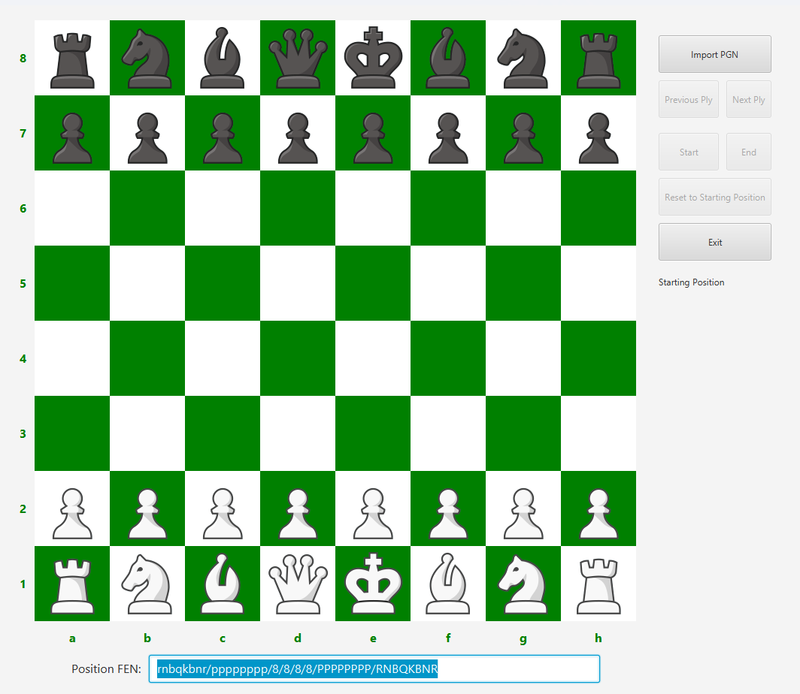

# JavaFX-PGN-Explorer
A simple program written in JavaFX to allow you to explore a chess Portable Game Notation (PGN) file.

### Installation
This repository uses the Maven build system for building artifacts and dependency management. Download the code and use Maven to build the ```JavaFX-PGN-Explorer.jar``` file by using the command line tool:

```mvn clean package```

The generated ```JavaFX-PGN-Explorer.jar``` file will be placed in Maven's ```target``` directory by default.

### Using the PGN Explorer
Opening the JAR file with a version of Java that includes the JavaFX libraries (e.g., Amazon Corretto v1.8.0), you will be presented with the main interface:



By default, the standard starting position and its corresponding Forsythe-Edwards Notation (FEN) is displayed.

#### Loading a PGN File
To begin viewing a game, it must be in the standard PGN format. Use the ```Import PGN``` button to choose a PGN file from your system.

#### Navigating The Loaded PGN File
Once the PGN file is loaded, you will be able to use the rest of the interface buttons to control which ply (half-move) of the game you are exploring:
* ```Previous Ply``` --> When not at the start of the game, this button will bring you back one ply.
* ```Next Ply``` --> When not at the end of the game, this button will bring you to the next ply.
* Start__ --> When not at the start of the game, this button will bring you back to the starting position.
* __End__ --> When not at the end of the game, this button will bring you to the last ply.

When a new ply is loaded, the corresponding position will be shown on the board, and the FEN string corresponding to the position will be shown under it.

#### More Functions
The ```Reset to Starting Position``` button will clear the PGN from the program and reset the board state to the default starting position.

The ```Exit``` button will ask you to confirm before closing the program.

#### Reading the Information Display
The information display will read ```Starting Position``` by default, and will change based on the ply being viewed. The display will tell you:
* The *__Standard Algebraic Notation__* for the ply you're currently viewing
* The *__Move Number__* you're viewing (i.e., the ply number / 2, +1 if it's an even ply)
* The *___ Ply Number__* you're viewing
* If the move you're viewing is __check__, __draw by stalemate__, __draw by threefold repetition__, __draw by insufficient material__, or __checkmate__

Examples of each of these are planned to be added soon.